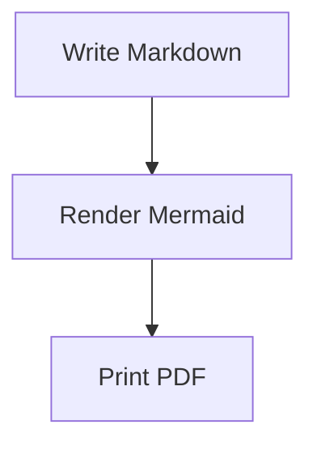

# md-to-pdf

[](https://github.com/MiguelElGallo/md-to-pdf/actions/workflows/ci.yml)
[](https://github.com/MiguelElGallo/md-to-pdf/actions/workflows/docs.yml)
[](https://github.com/MiguelElGallo/md-to-pdf/actions/workflows/release.yml)
[](https://github.com/MiguelElGallo/md-to-pdf/releases/latest)

Convert one Markdown file into one PDF, with Mermaid diagrams rendered before the PDF is written.

`md-to-pdf` reads one `.md` file, renders GitHub-style Markdown to browser-ready HTML, waits for Mermaid diagrams to finish, and writes a PDF using Chrome, Chromium, or Edge.

Full documentation is published at <https://miguelelgallo.github.io/md-to-pdf/> and organized with [Diataxis](https://diataxis.fr/): tutorials, how-to guides, reference, and explanation. The site is built with [Zensical](https://zensical.org/), and the Markdown sources live in [docs/index.md](docs/index.md).

## Requirements

- Rust with Cargo.
- Chrome, Chromium, or Microsoft Edge.
- Internet access for Mermaid diagrams by default.

Plain Markdown conversion does not need network access. Mermaid diagrams use jsDelivr by default, but you can pass a local Mermaid browser bundle for offline or reproducible builds.

## Install

macOS:

```sh
curl -fsSL https://raw.githubusercontent.com/MiguelElGallo/md-to-pdf/main/scripts/install-macos.sh | sh
```

The installer detects Apple Silicon vs Intel, downloads the latest macOS archive and matching checksum, verifies the checksum, and installs `md-to-pdf` to `/usr/local/bin`.

Linux:

```sh
shasum -a 256 -c md-to-pdf-v0.1.1-x86_64-unknown-linux-gnu.sha256
tar -xzf md-to-pdf-v0.1.1-x86_64-unknown-linux-gnu.tar.gz
sudo install md-to-pdf-v0.1.1-x86_64-unknown-linux-gnu/md-to-pdf /usr/local/bin/md-to-pdf
md-to-pdf --help
```

Windows PowerShell:

```powershell
Get-FileHash .\md-to-pdf-v0.1.1-x86_64-pc-windows-msvc.zip -Algorithm SHA256
Expand-Archive .\md-to-pdf-v0.1.1-x86_64-pc-windows-msvc.zip
.\md-to-pdf-v0.1.1-x86_64-pc-windows-msvc\md-to-pdf.exe --help
```

Compare the hash with the matching `.sha256` file before running the binary.

Install from source for development:

```sh
cargo install --path .
```

For development:

```sh
cargo build
```

## Quickstart

Create a file named `example.md`:

````markdown
# Release Flow

This diagram will render inside the PDF.


````

Convert it:

```sh
md-to-pdf example.md
```

You should see:

```text
Wrote example.pdf
```

The default output path is the input file name with a `.pdf` extension.

## Go deeper

- Follow the guided docs in [docs/index.md](docs/index.md).
- Look up flags and defaults in [docs/reference/cli.md](docs/reference/cli.md).
- Render Mermaid offline with [docs/how-to/use-local-mermaid.md](docs/how-to/use-local-mermaid.md).
- Choose a browser with [docs/how-to/choose-a-browser.md](docs/how-to/choose-a-browser.md).
- Inspect rendering problems with [docs/how-to/debug-rendering.md](docs/how-to/debug-rendering.md).
- Understand safety defaults in [docs/explanation/safety-model.md](docs/explanation/safety-model.md).
- Read the browser pipeline rationale in [docs/explanation/rendering-pipeline.md](docs/explanation/rendering-pipeline.md).

## Development

Run the standard checks:

```sh
cargo fmt --check
cargo test
uv run --locked --group docs zensical build --clean --strict
```

Run browser smoke tests by setting `MD_TO_PDF_BROWSER`:

```sh
MD_TO_PDF_BROWSER="/Applications/Microsoft Edge.app/Contents/MacOS/Microsoft Edge" \
  cargo test browser_smoke -- --nocapture
```

Manual smoke checks:

```sh
cargo run -- fixtures/basic.md --output /tmp/basic.pdf
cargo run -- fixtures/mermaid-flowchart.md --output /tmp/mermaid.pdf --virtual-time-budget 15000
cargo run -- fixtures/invalid-mermaid.md --output /tmp/invalid.pdf --virtual-time-budget 15000
```

The first two commands should create nonempty PDFs. The invalid Mermaid fixture should fail with `Mermaid render failed`.

## Current Scope

Included in this MVP:

- Single Markdown file to single PDF.
- Headings, lists, tables, task lists, code blocks, links, images, and basic GitHub-style Markdown extensions from `pulldown-cmark`.
- Mermaid fenced blocks rendered by a browser.
- Custom output path, page size, CSS, browser path, local Mermaid script, and generated HTML debugging.

Deferred for later releases:

- Batch conversion and glob support.
- Watch mode.
- Headers, footers, page numbers, and table of contents.
- Pixel-perfect PDF regression testing.
- Bundled Chromium or bundled Mermaid assets.
- Strong sandbox guarantees for untrusted Markdown.

## Release Checklist

- `cargo fmt --check` passes.
- `cargo test` passes.
- Browser smoke tests pass for plain Markdown, valid Mermaid, and invalid Mermaid.
- README quickstart is verified from a fresh clone.
- macOS, Linux, and Windows browser discovery are checked or documented.
- Offline Mermaid flow with `--mermaid-js` is verified before publishing a reproducible release.
- Release artifacts are extracted, checksum-verified, and smoke-tested before publishing.

GitHub Actions includes CI, documentation, and release workflows inspired by Astral's `uv` release setup: strict default permissions, concurrency control, an aggregate required-checks job, Zensical docs builds, multi-platform release artifacts, and SHA-256 checksum files.

Run a release dry run from the Actions tab with the `Release` workflow and `tag=dry-run`. It builds all archives and uploads them as workflow artifacts without creating a GitHub Release.

Publish a release by pushing a SemVer tag:

```sh
git tag v0.1.1
git push origin v0.1.1
```

You can also manually dispatch the `Release` workflow with a tag such as `v0.1.1`. The release workflow validates that the tag matches the package version before publishing.

## Roadmap

1. Add Apple Developer ID signing and notarization with `.zip`, `.pkg`, or `.dmg` macOS artifacts for trusted downloads.
2. Add browser smoke coverage on macOS and Windows.
3. Add PDF inspection tests for page count and expected text.
4. Add `--out-dir` and multiple input support.
5. Add config/front matter for page size, margins, theme, and Mermaid settings.
