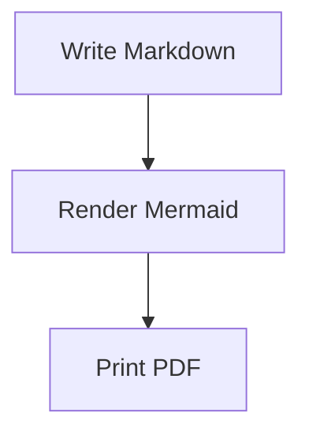
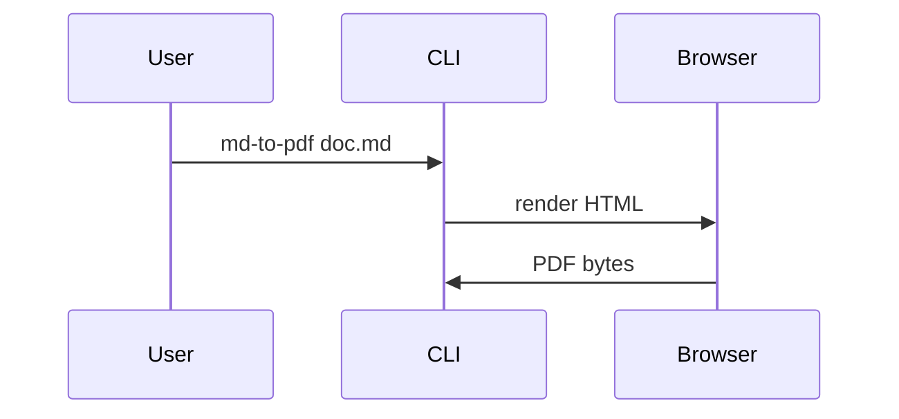

# md-to-pdf

[](https://github.com/MiguelElGallo/md-to-pdf/actions/workflows/ci.yml)
[](https://github.com/MiguelElGallo/md-to-pdf/actions/workflows/docs.yml)
[](https://github.com/MiguelElGallo/md-to-pdf/actions/workflows/release.yml)
[](https://github.com/MiguelElGallo/md-to-pdf/releases/latest)

Convert Markdown files into PDFs, including Mermaid diagrams, from a small Rust CLI.

`md-to-pdf` reads one `.md` file, renders GitHub-style Markdown to browser-ready HTML, waits for Mermaid diagrams to finish, and writes a PDF using Chrome, Chromium, or Edge.

Full documentation lives in [docs/index.md](docs/index.md) and is organized with Diataxis: tutorials, how-to guides, reference, and explanation. The site is built with [Zensical](https://zensical.org/).

## Requirements

- Rust with Cargo.
- Chrome, Chromium, or Microsoft Edge.
- Internet access for Mermaid diagrams by default.

Plain Markdown conversion does not need network access. Mermaid diagrams use jsDelivr by default, but you can pass a local Mermaid browser bundle for offline or reproducible builds.

## Install

Download the archive for your platform from the [latest release](https://github.com/MiguelElGallo/md-to-pdf/releases/latest), then download the matching `.sha256` file.

macOS and Linux:

```sh
shasum -a 256 -c md-to-pdf-v0.1.1-aarch64-apple-darwin.sha256
unzip md-to-pdf-v0.1.1-aarch64-apple-darwin.zip
sudo install md-to-pdf-v0.1.1-aarch64-apple-darwin/md-to-pdf /usr/local/bin/md-to-pdf
md-to-pdf --help
```

Use `x86_64-apple-darwin` for Intel Macs. Linux uses the `x86_64-unknown-linux-gnu.tar.gz` archive with `tar -xzf`.

Windows PowerShell:

```powershell
Get-FileHash .\md-to-pdf-v0.1.1-x86_64-pc-windows-msvc.zip -Algorithm SHA256
Expand-Archive .\md-to-pdf-v0.1.1-x86_64-pc-windows-msvc.zip
.\md-to-pdf-v0.1.1-x86_64-pc-windows-msvc\md-to-pdf.exe --help
```

Compare the hash with the matching `.sha256` file before running the binary.

### macOS trust status

macOS release artifacts are `.zip` archives. When Apple Developer ID secrets are configured for the release workflow, macOS binaries are signed with the hardened runtime and the zip archives are accepted by Apple's notary service. Unsigned macOS publishing is blocked unless a maintainer explicitly allows it in a manual release dispatch. If a release note says the macOS artifacts are unsigned, verify the SHA-256 checksum and expect Gatekeeper to warn on first run.

Install from source for development:

```sh
cargo install --path .
```

For development:

```sh
cargo build
```

## Quickstart

Create a file named `example.md`:

````markdown
# Release Flow

This diagram will render inside the PDF.


````

Convert it:

```sh
md-to-pdf example.md
```

You should see:

```text
Wrote example.pdf
```

The default output path is the input file name with a `.pdf` extension.

## Examples

Write to a specific path:

```sh
md-to-pdf fixtures/basic.md --output dist/basic.pdf
```

Use a specific browser:

```sh
md-to-pdf fixtures/basic.md \
  --browser "/Applications/Microsoft Edge.app/Contents/MacOS/Microsoft Edge"
```

Change page size:

```sh
md-to-pdf fixtures/basic.md --page-size Letter
```

Add custom print CSS:

```sh
md-to-pdf fixtures/basic.md --css print.css
```

Allow local files referenced by the generated HTML, such as local images:

```sh
md-to-pdf page-with-image.md --allow-local-files
```

Keep the generated HTML for debugging:

```sh
md-to-pdf fixtures/mermaid-flowchart.md --keep-html
```

## Mermaid Diagrams

Mermaid blocks are detected from fenced code blocks:

````markdown

````

The default Mermaid runtime is loaded from:

```text
https://cdn.jsdelivr.net/npm/mermaid@11.12.0/dist/mermaid.esm.min.mjs
```

For offline or repeatable builds, provide a local browser bundle that exposes `window.mermaid`:

```sh
md-to-pdf fixtures/mermaid-flowchart.md --mermaid-js ./vendor/mermaid.min.js
```

Invalid Mermaid syntax fails the command with a nonzero exit code before the PDF is written.

## CLI Reference

| Option | Default | Use it when |
| --- | --- | --- |
| `input` | Required | Choose the Markdown file to convert. |
| `-o, --output <PATH>` | `<input>.pdf` | Write the PDF somewhere specific. |
| `--browser <PATH>` | Auto-detect or `MD_TO_PDF_BROWSER` | Use a specific Chrome, Chromium, or Edge executable. |
| `--page-size <SIZE>` | `A4` | Set a CSS page size such as `Letter`, `Legal`, or `A4`. |
| `--css <PATH>` | None | Append custom print CSS after the built-in styles. |
| `--mermaid-url <URL>` | jsDelivr Mermaid 11.12.0 | Load Mermaid from a different ES module URL. |
| `--mermaid-js <PATH>` | None | Embed a local Mermaid browser bundle for offline rendering. |
| `--allow-html` | `false` | Let trusted raw HTML in Markdown pass through. |
| `--allow-local-files` | `false` | Let browser-rendered HTML read local file references. |
| `--virtual-time-budget <MS>` | `10000` | Increase wait time for large Mermaid diagrams or slow networks. |
| `--keep-html` | `false` | Write the intermediate HTML next to the PDF for debugging. |

Environment variables:

| Variable | Purpose |
| --- | --- |
| `MD_TO_PDF_BROWSER` | Browser executable path used when `--browser` is not passed. |

## Safe Defaults

- Raw HTML in Markdown is escaped unless `--allow-html` is passed.
- Mermaid runs with `securityLevel: "strict"`.
- Local file access is not enabled unless `--allow-local-files` is passed.
- Browser rendering waits for Mermaid readiness and fails on Mermaid errors.

Use `--allow-html` and `--allow-local-files` only for trusted local documents.

## How It Works

The CLI uses an HTML-first pipeline:

1. Parse Markdown with `pulldown-cmark`.
2. Rewrite fenced `mermaid` blocks into Mermaid containers.
3. Generate a print-focused HTML document.
4. Launch a Chromium-family browser with the Chrome DevTools Protocol.
5. Wait for Mermaid to report `ready`, or fail on `error`.
6. Print the page to PDF.

Recommended Rust packages in this implementation:

- `clap` for CLI parsing.
- `pulldown-cmark` for Markdown.
- `html-escape` for safe HTML escaping.
- `camino` for UTF-8 paths.
- `tempfile` for temporary HTML and browser profiles.
- `tungstenite`, `ureq`, and `serde_json` for minimal DevTools Protocol control.
- `which` and explicit app paths for browser discovery.

Tools intentionally deferred:

- `wkhtmltopdf`, because Mermaid needs modern JavaScript support.
- Pure Rust PDF crates, because browser layout and Mermaid rendering are the core hard parts.
- Pandoc as a hard dependency, because it adds install friction and still needs Mermaid integration.
- `mermaid-cli` as the primary renderer, because it brings Node and Puppeteer into the conversion path.

## Development

Run the standard checks:

```sh
cargo fmt --check
cargo test
uv run --locked --group docs zensical build --clean --strict
```

Run browser smoke tests by setting `MD_TO_PDF_BROWSER`:

```sh
MD_TO_PDF_BROWSER="/Applications/Microsoft Edge.app/Contents/MacOS/Microsoft Edge" \
  cargo test browser_smoke -- --nocapture
```

Manual smoke checks:

```sh
cargo run -- fixtures/basic.md --output /tmp/basic.pdf
cargo run -- fixtures/mermaid-flowchart.md --output /tmp/mermaid.pdf --virtual-time-budget 15000
cargo run -- fixtures/invalid-mermaid.md --output /tmp/invalid.pdf --virtual-time-budget 15000
```

The first two commands should create nonempty PDFs. The invalid Mermaid fixture should fail with `Mermaid render failed`.

## Current Scope

Included in this MVP:

- Single Markdown file to single PDF.
- Headings, lists, tables, task lists, code blocks, links, images, and basic GitHub-style Markdown extensions from `pulldown-cmark`.
- Mermaid fenced blocks rendered by a browser.
- Custom output path, page size, CSS, browser path, local Mermaid script, and generated HTML debugging.

Deferred for later releases:

- Batch conversion and glob support.
- Watch mode.
- Headers, footers, page numbers, and table of contents.
- Pixel-perfect PDF regression testing.
- Bundled Chromium or bundled Mermaid assets.
- Strong sandbox guarantees for untrusted Markdown.

## Release Checklist

- `cargo fmt --check` passes.
- `cargo test` passes.
- Browser smoke tests pass for plain Markdown, valid Mermaid, and invalid Mermaid.
- README quickstart is verified from a fresh clone.
- macOS, Linux, and Windows browser discovery are checked or documented.
- Offline Mermaid flow with `--mermaid-js` is verified before publishing a reproducible release.
- Release artifacts are extracted, checksum-verified, and smoke-tested before publishing.

GitHub Actions includes CI, documentation, and release workflows inspired by Astral's `uv` release setup: strict default permissions, concurrency control, an aggregate required-checks job, Zensical docs builds, multi-platform release artifacts, and SHA-256 checksum files.

Run a release dry run from the Actions tab with the `Release` workflow and `tag=dry-run`. It builds all archives and uploads them as workflow artifacts without creating a GitHub Release.

Publish a release by pushing a SemVer tag:

```sh
git tag v0.1.1
git push origin v0.1.1
```

You can also manually dispatch the `Release` workflow with a tag such as `v0.1.1`. The release workflow validates that the tag matches the package version before publishing.

## Roadmap

1. Add Apple Developer ID signing and notarization with `.zip`, `.pkg`, or `.dmg` macOS artifacts for trusted downloads.
2. Add browser smoke coverage on macOS and Windows.
3. Add PDF inspection tests for page count and expected text.
4. Add `--out-dir` and multiple input support.
5. Add config/front matter for page size, margins, theme, and Mermaid settings.
