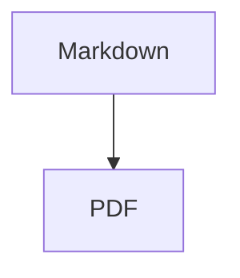

# md-to-pdf

[](https://github.com/MiguelElGallo/md-to-pdf/actions/workflows/ci.yml)
[](https://github.com/MiguelElGallo/md-to-pdf/releases/latest)

Convert Markdown to PDF with Mermaid diagrams using Chrome, Chromium, or Edge.

## Install as an Agent Plugin

This repository is an [Agent Plugins 1.0.0](https://github.com/agentplugins/agent-plugins-spec)-compliant package.

For Codex CLI, add the repository marketplace and install `md-to-pdf`:

```sh
codex plugin marketplace add MiguelElGallo/md-to-pdf
codex plugin add md-to-pdf@md-to-pdf
```

For GitHub Copilot CLI, use the equivalent marketplace commands:

```sh
copilot plugin marketplace add MiguelElGallo/md-to-pdf
copilot plugin install md-to-pdf@md-to-pdf
```

Start a new Codex or Copilot session after installation so the plugin's skill and MCP tool are available.

### VS Code

1. Install Python 3 and Chrome, Chromium, or Edge.
2. In VS Code, run **Chat: Install Plugin From Source** from the Command Palette.
3. Enter `https://github.com/MiguelElGallo/md-to-pdf`.

VS Code clones and enables the plugin. On the first conversion, its dependency-free
Python MCP server downloads a compatible `md-to-pdf` release binary, verifies its
SHA-256 checksum, and caches it in the plugin's persistent data directory. No
administrator access or separate CLI installation is required.

### MCP tool

`convert_markdown_to_pdf` requires `input` and supports `output`, `title`, `page_size`, `css`, `mermaid_url`, `allow_html`, `allow_local_files`, and `browser`.

Example arguments:

```json
{
  "input": "/path/to/document.md",
  "output": "/path/to/document.pdf",
  "page_size": "Letter"
}
```

Set `MD_TO_PDF_BIN` to use an existing binary or `MD_TO_PDF_BROWSER` to select a
browser. Set `MD_TO_PDF_AUTO_INSTALL=0` to disable the automatic binary download.

## Install the CLI

Download a release from [GitHub Releases](https://github.com/MiguelElGallo/md-to-pdf/releases/latest), or install on macOS:

```sh
curl -fsSL https://raw.githubusercontent.com/MiguelElGallo/md-to-pdf/main/scripts/install-macos.sh | sh
```

Build from source:

```sh
cargo install --git https://github.com/MiguelElGallo/md-to-pdf
```

## Use the CLI

```sh
md-to-pdf document.md
```

The default output is `document.pdf`. Common options:

```sh
md-to-pdf document.md \
  --output report.pdf \
  --title "Report" \
  --page-size Letter \
  --css print.css
```

Mermaid fenced code blocks render automatically:

````markdown

```mermaid
graph TD
  A[Markdown] --> B[PDF]
```
````

Use `md-to-pdf --help` for all options.

## Requirements

- Chrome, Chromium, or Microsoft Edge
- Internet access for Mermaid by default; use `--mermaid-js` for offline rendering
- Rust and Cargo only when building from source

## Documentation

- [Full documentation](https://miguelelgallo.github.io/md-to-pdf/)
- [CLI reference](docs/reference/cli.md)
- [Choose a browser](docs/how-to/choose-a-browser.md)
- [Use Mermaid offline](docs/how-to/use-local-mermaid.md)
- [Safety model](docs/explanation/safety-model.md)

## Development

```sh
cargo fmt --check
cargo test
uv run --locked --group docs zensical build --clean --strict
```

See [LICENSE](LICENSE).
