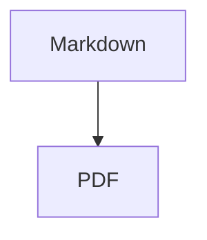

# md-to-pdf

[](https://github.com/MiguelElGallo/md-to-pdf/actions/workflows/ci.yml)
[](https://github.com/MiguelElGallo/md-to-pdf/releases/latest)

Convert Markdown to PDF with Mermaid diagrams using Chrome, Chromium, or Edge.

## Install the agent plugin

The plugin bundles a conversion skill and an MCP tool. You do not need Rust, a Python package install, or a separate `md-to-pdf` CLI installation.

### Before you start

- Install Chrome, Chromium, or Microsoft Edge.
- Install **Python 3.11 or newer**, available as `python3` in the environment that launches your agent. Check with `python3 --version`. On Windows, `python` or `py` alone is not enough for the plugin's launcher; see [troubleshooting](docs/how-to/install.md#troubleshooting).
- Use a Codex or Copilot client with plugin support and Git available for marketplace installation.
- Allow access to GitHub Releases on the first conversion. Mermaid diagrams use a CDN by default; [offline rendering](docs/how-to/install.md#offline-use) is also supported.

Automatic binary installation supports macOS Apple Silicon/Intel, Linux x86_64, and Windows x86_64. Other platforms require a compatible binary supplied through `MD_TO_PDF_BIN`.

### Codex CLI

```sh
codex plugin marketplace add MiguelElGallo/md-to-pdf
codex plugin add md-to-pdf@md-to-pdf
```

### GitHub Copilot CLI

```sh
copilot plugin marketplace add MiguelElGallo/md-to-pdf
copilot plugin install md-to-pdf@md-to-pdf
```

### First conversion

Start a **new session** after installation, open the folder containing your Markdown file, and ask:

> Convert report.md to a PDF using md-to-pdf and give me a link to the result.

The skill checks the source and output paths, calls the converter, and returns the PDF. The first conversion downloads the plugin's version-matched release binary, verifies its SHA-256 checksum, and caches it. Later conversions reuse that cache. No administrator access is required for this download.

Confirm that the PDF opens and its text and diagrams are present. For a different layout, ask: “Convert report.md to a Letter-sized PDF using print.css.”

### Update or uninstall

Update Codex's marketplace snapshot, then install the current plugin version:

```sh
codex plugin marketplace upgrade md-to-pdf
codex plugin add md-to-pdf@md-to-pdf
```

Update Copilot's marketplace and plugin:

```sh
copilot plugin marketplace update md-to-pdf
copilot plugin update md-to-pdf
```

Start a new session after updating. By default, the plugin selects its matching binary even if an older CLI is on your `PATH`. An explicit `MD_TO_PDF_BIN` override remains your responsibility to update.

To uninstall, run the command for your client:

```sh
codex plugin remove md-to-pdf@md-to-pdf
# Or, for Copilot:
copilot plugin uninstall md-to-pdf
```

Your Markdown and generated PDFs are not removed. See the [installation guide](docs/how-to/install.md) for verification, marketplace removal, skill-only setup, and troubleshooting. The Codex commands are checked against `codex-cli 0.153.4`; Copilot's commands are covered in its [plugin reference](https://docs.github.com/en/copilot/reference/copilot-cli-reference/cli-plugin-reference).

### VS Code

In a VS Code version supporting agent plugins, run **Chat: Install Plugin From Source** from the Command Palette and enter `https://github.com/MiguelElGallo/md-to-pdf`. Start a new chat and use the same first-conversion prompt above. The same Python and browser requirements apply.

### MCP options

The `convert_markdown_to_pdf` tool accepts absolute file paths:

```json
{
  "input": "/path/to/document.md",
  "output": "/path/to/document.pdf",
  "page_size": "Letter"
}
```

Optional settings include `title`, `css`, `browser`, `mermaid_js` (a local browser bundle), `mermaid_url` (an alternative ES-module URL), `virtual_time_budget_ms` (1–60000, default 10000), and `keep_html`. Use only one Mermaid source. Raw HTML, browser local-file access, and remote document assets are disabled by default; enable `allow_html`, `allow_local_files`, or `allow_remote_assets` only for trusted content that needs them. The built-in Mermaid CDN remains available without the remote-asset opt-in. See the [safety model](docs/explanation/safety-model.md).

Set `MD_TO_PDF_BROWSER` to select a browser. Set `MD_TO_PDF_BIN` to use a specific executable, or `MD_TO_PDF_AUTO_INSTALL=0` to disable downloads and use an installed CLI on `PATH`. These manual modes do not guarantee a version match.

## Install and use the CLI

The standalone CLI needs a browser, but not Python. Download an archive from [GitHub Releases](https://github.com/MiguelElGallo/md-to-pdf/releases/latest), or install on macOS:

```sh
curl -fsSL https://raw.githubusercontent.com/MiguelElGallo/md-to-pdf/main/scripts/install-macos.sh | sh
```

The macOS script installs to `/usr/local/bin` and requests administrator access. For manual, no-admin installation or building from source, see the [installation guide](docs/how-to/install.md).

```sh
md-to-pdf document.md
md-to-pdf document.md --output report.pdf --title "Report" --page-size Letter --css print.css
```

The default output is `document.pdf`. Mermaid fenced code blocks render automatically:

````markdown

```mermaid
graph TD
  A[Markdown] --> B[PDF]
```
````

Use `md-to-pdf --help` for all options. Rust and Cargo are required only when building from source.

## Documentation

- [Full documentation](https://miguelelgallo.github.io/md-to-pdf/)
- [Install, update, and troubleshoot](docs/how-to/install.md)
- [CLI reference](docs/reference/cli.md)
- [Choose a browser](docs/how-to/choose-a-browser.md)
- [Use Mermaid offline](docs/how-to/use-local-mermaid.md)
- [Safety model](docs/explanation/safety-model.md)

## Development

```sh
cargo fmt --check
cargo test
python3 -m unittest discover -s mcp_server
uv run --locked --group docs zensical build --clean --strict
```

See [LICENSE](LICENSE).
