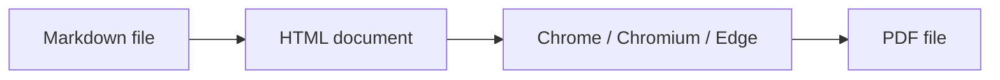

# md-to-pdf documentation

Convert one Markdown file into one PDF, with Mermaid diagrams rendered before the PDF is written.

`md-to-pdf` turns Markdown into browser-ready HTML, waits for Mermaid diagrams to finish, and asks Chrome, Chromium, or Edge to print the page as a PDF.

Start with one file:

```sh
md-to-pdf guide.md
```

By default, this writes `guide.pdf` next to `guide.md`.



## Find your way around

This documentation follows the [Diataxis](https://diataxis.fr/) framework. Pick the section that matches what you need right now.

<div class="grid cards" markdown>

-   :lucide-graduation-cap: **Tutorials**

	---

	*Learning-oriented.* Start with a small Markdown file, then add Mermaid diagrams.

	[:lucide-arrow-right: Start learning](tutorials/index.md)

-   :lucide-wrench: **How-to guides**

	---

	*Task-oriented.* Install the CLI, choose a browser, add CSS, use local assets, debug rendering, and run in CI.

	[:lucide-arrow-right: Solve a task](how-to/index.md)

-   :lucide-book-open: **Reference**

	---

	*Information-oriented.* Look up CLI options, defaults, supported Markdown, configuration, and errors.

	[:lucide-arrow-right: Look up details](reference/index.md)

-   :lucide-lightbulb: **Explanation**

	---

	*Understanding-oriented.* Learn why `md-to-pdf` uses a browser and how Mermaid, safety, and tradeoffs work.

	[:lucide-arrow-right: Understand the design](explanation/index.md)

</div>

## Requirements

!!! note "Browser required"
	`md-to-pdf` needs Chrome, Chromium, or Microsoft Edge for PDF rendering.

Plain Markdown conversion works offline. Mermaid diagrams use jsDelivr by default unless you provide a local Mermaid browser bundle.

See [Install md-to-pdf](how-to/install.md) for platform-specific installation steps.

## Why use a browser?

Markdown-to-PDF tools often struggle when diagrams need JavaScript and browser layout. `md-to-pdf` keeps the pipeline HTML-first so Mermaid and print CSS run in the same environment that creates the PDF.

For the design details, read [Rendering pipeline](explanation/rendering-pipeline.md) and [Design tradeoffs](explanation/design-tradeoffs.md).

## Maintainers

Maintainer pages cover release operations such as macOS signing and the release checklist. They are contributor-facing, separate from the user-facing Diataxis sections.
