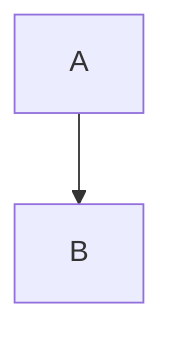

# Markdown support

Markdown is parsed with `pulldown-cmark`.

## Enabled Markdown features

- Headings.
- Paragraphs.
- Lists.
- Links.
- Images.
- Tables.
- Footnotes.
- Strikethrough.
- Task lists.
- Heading attributes.
- Fenced code blocks.

## Heading anchors and PDF outline

Headings without an explicit `{#id}` attribute get a GitHub-style anchor: lowercase text, spaces replaced by `-`, and punctuation removed. Duplicate anchors get `-1`, `-2`, and so on. Links such as `[Results](#results)` become clickable links inside the PDF.

The PDF also includes a document outline (bookmarks) built from the headings, and is generated as a tagged PDF for better accessibility. Browsers that do not support these options still produce a PDF without them.

## Mermaid fences

Fenced code blocks whose first info-string word is `mermaid` are rendered as Mermaid diagrams:

````markdown

````

Non-Mermaid code fences remain code blocks.

## Raw HTML

Raw HTML is escaped by default. Pass `--allow-html` only for trusted Markdown.
