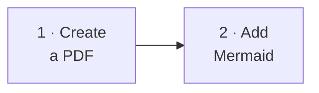

# Tutorials

Tutorials are guided lessons. They take you through a complete result one step at a time.

Start with [Create your first PDF](first-pdf.md) if you are new to `md-to-pdf`. Then use [Render Mermaid diagrams](markdown-with-mermaid.md) to add a diagram and see how rendering failures are reported.

## Lessons

-   :lucide-file-plus-2: **[Create your first PDF](first-pdf.md)**

		---

		Create a small Markdown file and convert it to `example.pdf`.

-   :lucide-chart-network: **[Render Mermaid diagrams](markdown-with-mermaid.md)**

		---

		Add a Mermaid flowchart, render it into a PDF, and see how failures are reported.

