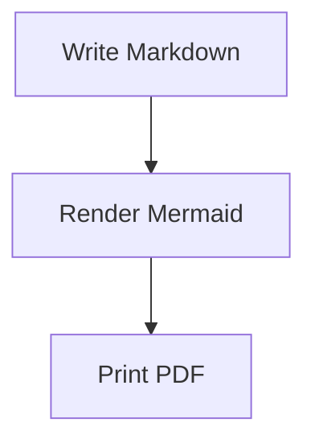

# Render Mermaid diagrams

In this tutorial, we will add a Mermaid diagram to Markdown and produce a PDF that contains the rendered diagram.

## Create the document

Create `diagram.md`:

````markdown
# Release Flow


````

## Convert it

Run:

```sh
cargo run -- diagram.md --virtual-time-budget 15000
```

You should see:

```text
Wrote diagram.pdf
```

Open `diagram.pdf`. The diagram should appear where the fenced Mermaid block was in the Markdown file.

## Notice the failure behavior

Now remove `C[Print PDF]` from the last Mermaid line so the diagram is incomplete, then run the command again.

You should see an error that starts with:

```text
Error: Mermaid render failed:
```

The command fails before reporting success.
