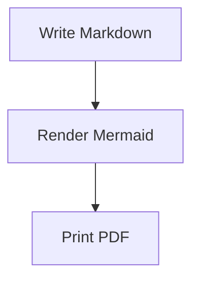

# Render Mermaid diagrams

In this tutorial, we will add a Mermaid diagram to Markdown and produce a PDF that contains the rendered diagram.

By the end, you will have a PDF with a rendered flowchart and you will see how Mermaid errors are reported.

## Create the document

Create `diagram.md`:

````markdown
# Release Flow


````

## Convert it

Run:

```sh
md-to-pdf diagram.md
```

From the repository, use `cargo run -- diagram.md` instead.

You should see:

```text
Wrote diagram.pdf
```

Open `diagram.pdf`. The diagram should appear where the fenced Mermaid block was in the Markdown file.

If the diagram is large or the network is slow, give Mermaid more time:

```sh
md-to-pdf diagram.md --virtual-time-budget 15000
```

## Notice the failure behavior

Now change this line:

```mermaid
  B --> C[Print PDF]
```

to this incomplete line:

```mermaid
  B -->
```

Then run the command again.

You should see an error that starts with:

```text
Error: Mermaid render failed:
```

The command fails before reporting success.

Next, read [Use Mermaid offline](../how-to/use-local-mermaid.md) for reproducible builds, or check [Error messages](../reference/errors.md) when a render fails.
